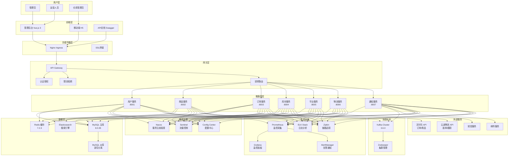
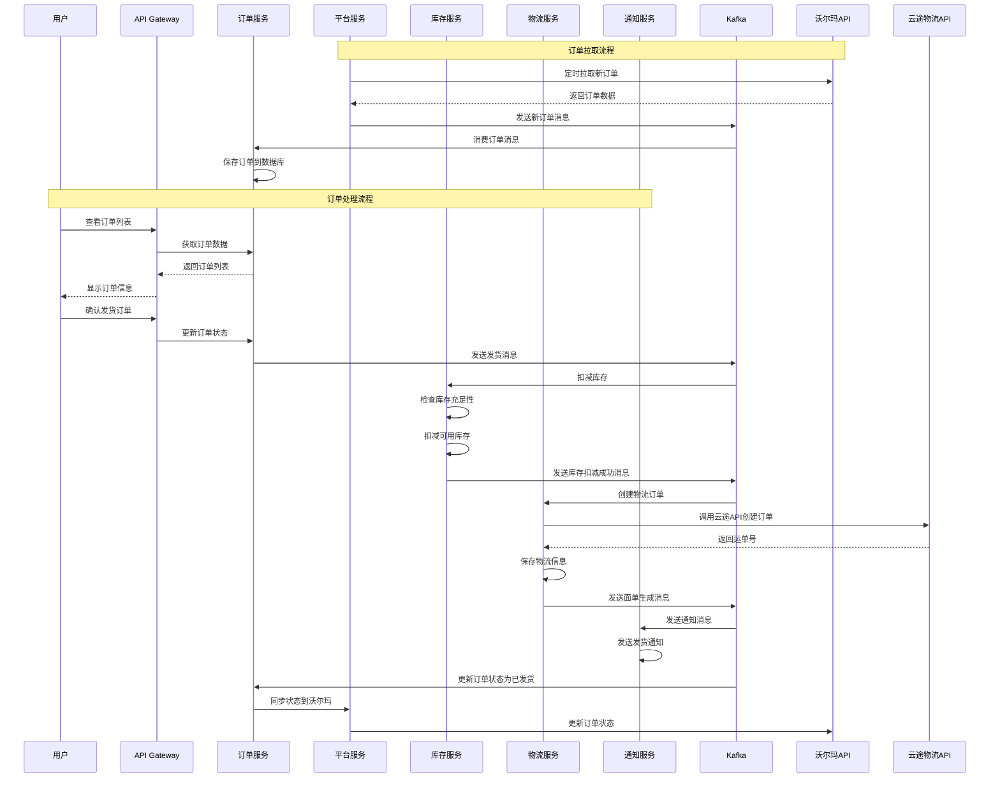
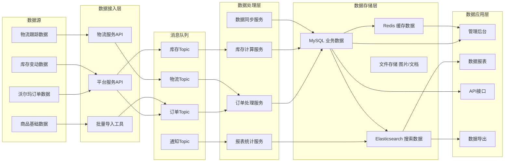

# 电商ERP系统设计文档

## 概述

本系统采用微服务架构设计，构建一套高可用、可扩展的电商ERP管理系统。系统主要对接沃尔玛电商平台和云途物流，实现订单管理、商品管理、库存管理、物流管理等核心业务功能。

### 详细技术栈版本选择

#### 后端技术栈
- **Java**: OpenJDK 17 LTS (长期支持版本，性能优异，安全性好)
- **Spring Boot**: 3.2.0 (最新稳定版，支持Java 17+)
- **Spring Cloud**: 2023.0.0 (Leyton版本，与Spring Boot 3.2兼容)
- **Spring Cloud Gateway**: 4.1.0 (高性能网关)
- **Spring Data JPA**: 3.2.0 (数据访问层)
- **Spring Security**: 6.2.0 (安全框架)

#### 数据存储
- **MySQL**: 8.0.35 (最新稳定版，性能和安全性最佳)
- **Redis**: 7.2.3 (最新稳定版，支持更多数据结构)
- **MyBatis Plus**: 3.5.4 (简化数据库操作)

#### 消息队列
- **Apache Kafka**: 3.6.0 (最新稳定版，性能和稳定性最佳)
- **Kafka Streams**: 3.6.0 (流处理)

#### 服务治理
- **Nacos**: 2.3.0 (最新稳定版，服务注册发现)
- **Sentinel**: 1.8.6 (流量控制和熔断)

#### 前端技术栈
- **Node.js**: 20.10.0 LTS (长期支持版本)
- **Vue.js**: 3.3.8 (最新稳定版)
- **Element Plus**: 2.4.4 (Vue 3 UI组件库)
- **TypeScript**: 5.3.2 (类型安全)
- **Vite**: 5.0.5 (构建工具)
- **Pinia**: 2.1.7 (状态管理)

#### 容器化和部署
- **Docker**: 24.0.7 (最新稳定版)
- **Kubernetes**: 1.33.3 (最新稳定版)
- **Helm**: 3.13.2 (包管理工具)
- **Ingress-Nginx**: 1.9.4 (入口控制器)

#### 构建和开发工具
- **Maven**: 3.9.5 (项目构建管理)
- **Maven Wrapper**: 3.9.5 (统一Maven版本)
- **Docker Maven Plugin**: 0.43.4 (容器构建)
- **Spring Boot Maven Plugin**: 3.2.0 (应用打包)
- **Jacoco**: 0.8.10 (代码覆盖率)
- **Checkstyle**: 10.12.4 (代码规范检查)
- **SpotBugs**: 4.8.1 (静态代码分析)

#### 监控和运维
- **Prometheus**: 2.47.2 (监控系统)
- **Grafana**: 10.2.2 (可视化面板)
- **ELK Stack**: 
  - Elasticsearch: 8.11.1
  - Logstash: 8.11.1  
  - Kibana: 8.11.1
- **Zipkin**: 2.24.3 (链路追踪)

### 消息队列选择对比

| 特性 | Apache Kafka | RabbitMQ | Apache RocketMQ |
|------|-------------|----------|-----------------|
| **吞吐量** | 极高 (百万级/秒) | 中等 (万级/秒) | 高 (十万级/秒) |
| **延迟** | 低 (ms级) | 极低 (μs级) | 低 (ms级) |
| **可靠性** | 高 | 高 | 极高 |
| **运维复杂度** | 中等 | 低 | 中等 |
| **生态支持** | 极好 | 好 | 中等 |
| **适用场景** | 大数据、日志收集 | 传统消息队列 | 电商、金融 |

**推荐使用Kafka的原因：**
1. **高吞吐量**: 电商系统订单量大，Kafka能处理高并发消息
2. **数据持久化**: 支持消息持久化，便于数据回溯和审计
3. **分区机制**: 天然支持水平扩展，适合微服务架构
4. **生态丰富**: 与Spring Cloud、监控系统集成良好
5. **成本效益**: 单机即可支持大量消息，运维成本相对较低

## 架构设计

### 系统整体架构图



### 订单处理流程图



### 数据流架构图



### 微服务拆分

#### 1. 用户服务 (User Service)
- **职责**: 用户认证、权限管理、用户信息管理
- **端口**: 8001
- **数据库**: user_db

#### 2. 商品服务 (Product Service)  
- **职责**: SKU管理、商品信息管理、商品分类
- **端口**: 8002
- **数据库**: product_db

#### 3. 订单服务 (Order Service)
- **职责**: 订单管理、订单状态跟踪、订单处理流程
- **端口**: 8003
- **数据库**: order_db

#### 4. 库存服务 (Inventory Service)
- **职责**: 库存管理、库存预警、库存调整
- **端口**: 8004
- **数据库**: inventory_db

#### 5. 平台服务 (Platform Service)
- **职责**: 电商平台对接、沃尔玛API集成、平台配置管理
- **端口**: 8005
- **数据库**: platform_db

#### 6. 物流服务 (Logistics Service)
- **职责**: 物流商对接、云途物流API集成、面单生成
- **端口**: 8006
- **数据库**: logistics_db

#### 7. 通知服务 (Notification Service)
- **职责**: 消息通知、邮件发送、系统告警
- **端口**: 8007
- **数据库**: notification_db

## 组件和接口设计

### 核心组件

#### 1. 平台适配器组件
```java
public interface PlatformAdapter {
    // 订单拉取
    List<Order> fetchOrders(String storeId, Date fromDate, Date toDate);
    
    // 商品上传
    boolean uploadProduct(String storeId, Product product);
    
    // 库存同步
    boolean syncInventory(String storeId, String sku, int quantity);
    
    // 订单状态更新
    boolean updateOrderStatus(String storeId, String orderId, OrderStatus status);
}

// 沃尔玛平台实现
@Component
public class WalmartPlatformAdapter implements PlatformAdapter {
    // 具体实现
}
```

#### 2. 物流适配器组件
```java
public interface LogisticsAdapter {
    // 创建物流订单
    LogisticsOrder createShippingOrder(ShippingRequest request);
    
    // 生成面单
    ShippingLabel generateLabel(String trackingNumber);
    
    // 查询物流状态
    LogisticsStatus queryStatus(String trackingNumber);
    
    // 取消物流订单
    boolean cancelOrder(String trackingNumber);
}

// 云途物流实现
@Component
public class YunExpressLogisticsAdapter implements LogisticsAdapter {
    // 具体实现
}
```

#### 3. 库存管理组件
```java
@Component
public class InventoryManager {
    // 库存扣减
    public boolean deductInventory(String sku, int quantity, String orderId);
    
    // 库存释放
    public boolean releaseInventory(String sku, int quantity, String orderId);
    
    // 库存预警检查
    public void checkInventoryAlert(String sku);
    
    // 多店铺库存分配
    public boolean allocateInventory(String sku, Map<String, Integer> storeAllocation);
}
```

### API接口设计

#### 订单管理API
```
GET /api/orders                    # 获取订单列表
GET /api/orders/{orderId}          # 获取订单详情
POST /api/orders/sync              # 同步平台订单
PUT /api/orders/{orderId}/status   # 更新订单状态
POST /api/orders/{orderId}/ship    # 订单发货
```

#### 商品管理API
```
GET /api/products                  # 获取商品列表
GET /api/products/{sku}            # 获取商品详情
POST /api/products                 # 创建商品
PUT /api/products/{sku}            # 更新商品
POST /api/products/upload          # 上传商品到平台
POST /api/products/batch-import    # 批量导入商品
```

#### 库存管理API
```
GET /api/inventory                 # 获取库存列表
GET /api/inventory/{sku}           # 获取SKU库存
PUT /api/inventory/{sku}           # 调整库存
GET /api/inventory/alerts          # 获取库存预警
POST /api/inventory/allocate       # 库存分配
```

#### 店铺管理API
```
GET /api/stores                    # 获取店铺列表
POST /api/stores                   # 添加店铺
PUT /api/stores/{storeId}          # 更新店铺配置
DELETE /api/stores/{storeId}       # 删除店铺
POST /api/stores/{storeId}/test    # 测试店铺连接
```

## 数据模型设计

### 核心数据表

#### 1. 商品表 (products)
```sql
CREATE TABLE products (
    id BIGINT PRIMARY KEY AUTO_INCREMENT,
    sku VARCHAR(100) UNIQUE NOT NULL,
    title VARCHAR(500) NOT NULL,
    description TEXT,
    category_id BIGINT,
    brand VARCHAR(100),
    price DECIMAL(10,2),
    cost_price DECIMAL(10,2),
    weight DECIMAL(8,3),
    dimensions VARCHAR(100),
    images JSON,
    attributes JSON,
    status ENUM('ACTIVE', 'INACTIVE', 'DELETED'),
    created_at TIMESTAMP DEFAULT CURRENT_TIMESTAMP,
    updated_at TIMESTAMP DEFAULT CURRENT_TIMESTAMP ON UPDATE CURRENT_TIMESTAMP
);
```

#### 2. 订单表 (orders)
```sql
CREATE TABLE orders (
    id BIGINT PRIMARY KEY AUTO_INCREMENT,
    order_id VARCHAR(100) UNIQUE NOT NULL,
    platform_order_id VARCHAR(100),
    store_id BIGINT NOT NULL,
    customer_name VARCHAR(100),
    customer_email VARCHAR(100),
    shipping_address JSON,
    billing_address JSON,
    total_amount DECIMAL(10,2),
    currency VARCHAR(10),
    status ENUM('PENDING', 'CONFIRMED', 'SHIPPED', 'DELIVERED', 'CANCELLED'),
    platform_status VARCHAR(50),
    order_date TIMESTAMP,
    ship_date TIMESTAMP,
    tracking_number VARCHAR(100),
    created_at TIMESTAMP DEFAULT CURRENT_TIMESTAMP,
    updated_at TIMESTAMP DEFAULT CURRENT_TIMESTAMP ON UPDATE CURRENT_TIMESTAMP
);
```

#### 3. 订单明细表 (order_items)
```sql
CREATE TABLE order_items (
    id BIGINT PRIMARY KEY AUTO_INCREMENT,
    order_id BIGINT NOT NULL,
    sku VARCHAR(100) NOT NULL,
    product_title VARCHAR(500),
    quantity INT NOT NULL,
    unit_price DECIMAL(10,2),
    total_price DECIMAL(10,2),
    FOREIGN KEY (order_id) REFERENCES orders(id)
);
```

#### 4. 库存表 (inventory)
```sql
CREATE TABLE inventory (
    id BIGINT PRIMARY KEY AUTO_INCREMENT,
    sku VARCHAR(100) NOT NULL,
    store_id BIGINT,
    available_quantity INT DEFAULT 0,
    reserved_quantity INT DEFAULT 0,
    total_quantity INT DEFAULT 0,
    safety_stock INT DEFAULT 0,
    warehouse_location VARCHAR(100),
    last_updated TIMESTAMP DEFAULT CURRENT_TIMESTAMP ON UPDATE CURRENT_TIMESTAMP,
    UNIQUE KEY uk_sku_store (sku, store_id)
);
```

#### 5. 店铺表 (stores)
```sql
CREATE TABLE stores (
    id BIGINT PRIMARY KEY AUTO_INCREMENT,
    store_name VARCHAR(100) NOT NULL,
    platform VARCHAR(50) NOT NULL,
    platform_store_id VARCHAR(100),
    api_credentials JSON,
    status ENUM('ACTIVE', 'INACTIVE'),
    last_sync_time TIMESTAMP,
    created_at TIMESTAMP DEFAULT CURRENT_TIMESTAMP,
    updated_at TIMESTAMP DEFAULT CURRENT_TIMESTAMP ON UPDATE CURRENT_TIMESTAMP
);
```

## 错误处理设计

### 统一异常处理
```java
@RestControllerAdvice
public class GlobalExceptionHandler {
    
    @ExceptionHandler(PlatformApiException.class)
    public ResponseEntity<ErrorResponse> handlePlatformApiException(PlatformApiException e) {
        // 处理平台API异常
    }
    
    @ExceptionHandler(LogisticsApiException.class)
    public ResponseEntity<ErrorResponse> handleLogisticsApiException(LogisticsApiException e) {
        // 处理物流API异常
    }
    
    @ExceptionHandler(InventoryInsufficientException.class)
    public ResponseEntity<ErrorResponse> handleInventoryException(InventoryInsufficientException e) {
        // 处理库存不足异常
    }
}
```

### 重试机制
```java
@Component
public class RetryableApiClient {
    
    @Retryable(value = {ApiException.class}, maxAttempts = 3, backoff = @Backoff(delay = 1000))
    public ApiResponse callExternalApi(ApiRequest request) {
        // API调用逻辑
    }
    
    @Recover
    public ApiResponse recover(ApiException ex, ApiRequest request) {
        // 重试失败后的恢复逻辑
    }
}
```

## 测试策略

### 测试层次
1. **单元测试**: 使用JUnit 5 + Mockito，覆盖率要求80%以上
2. **集成测试**: 使用TestContainers进行数据库和消息队列测试
3. **API测试**: 使用RestAssured进行接口测试
4. **端到端测试**: 使用Selenium进行UI自动化测试

### 测试环境
- **开发环境**: 本地Docker环境
- **测试环境**: 独立的测试服务器环境
- **预生产环境**: 与生产环境配置相同的环境

### 外部API测试
- 使用WireMock模拟沃尔玛和云途物流API
- 提供测试数据和异常场景模拟
- 支持API限流和超时测试

## 部署和运维

### Kubernetes部署架构

```yaml
# namespace.yaml
apiVersion: v1
kind: Namespace
metadata:
  name: erp-system
---
# mysql-deployment.yaml
apiVersion: apps/v1
kind: Deployment
metadata:
  name: mysql
  namespace: erp-system
spec:
  replicas: 1
  selector:
    matchLabels:
      app: mysql
  template:
    metadata:
      labels:
        app: mysql
    spec:
      containers:
      - name: mysql
        image: mysql:8.0
        env:
        - name: MYSQL_ROOT_PASSWORD
          valueFrom:
            secretKeyRef:
              name: mysql-secret
              key: password
        - name: MYSQL_DATABASE
          value: "erp_system"
        ports:
        - containerPort: 3306
        volumeMounts:
        - name: mysql-storage
          mountPath: /var/lib/mysql
      volumes:
      - name: mysql-storage
        persistentVolumeClaim:
          claimName: mysql-pvc
---
# kafka-deployment.yaml
apiVersion: apps/v1
kind: Deployment
metadata:
  name: kafka
  namespace: erp-system
spec:
  replicas: 3
  selector:
    matchLabels:
      app: kafka
  template:
    metadata:
      labels:
        app: kafka
    spec:
      containers:
      - name: kafka
        image: confluentinc/cp-kafka:latest
        env:
        - name: KAFKA_ZOOKEEPER_CONNECT
          value: "zookeeper:2181"
        - name: KAFKA_ADVERTISED_LISTENERS
          value: "PLAINTEXT://kafka:9092"
        - name: KAFKA_OFFSETS_TOPIC_REPLICATION_FACTOR
          value: "3"
        ports:
        - containerPort: 9092
---
# api-gateway-deployment.yaml
apiVersion: apps/v1
kind: Deployment
metadata:
  name: api-gateway
  namespace: erp-system
spec:
  replicas: 2
  selector:
    matchLabels:
      app: api-gateway
  template:
    metadata:
      labels:
        app: api-gateway
    spec:
      containers:
      - name: api-gateway
        image: erp-system/api-gateway:latest
        ports:
        - containerPort: 8080
        env:
        - name: NACOS_SERVER
          value: "nacos:8848"
        resources:
          requests:
            memory: "512Mi"
            cpu: "250m"
          limits:
            memory: "1Gi"
            cpu: "500m"
---
# ingress.yaml
apiVersion: networking.k8s.io/v1
kind: Ingress
metadata:
  name: erp-system-ingress
  namespace: erp-system
  annotations:
    kubernetes.io/ingress.class: nginx
    cert-manager.io/cluster-issuer: letsencrypt-prod
spec:
  tls:
  - hosts:
    - erp.yourdomain.com
    secretName: erp-tls
  rules:
  - host: erp.yourdomain.com
    http:
      paths:
      - path: /
        pathType: Prefix
        backend:
          service:
            name: api-gateway
            port:
              number: 8080
```

### Kubernetes部署优势
1. **高可用性**: 自动故障转移和服务恢复
2. **弹性伸缩**: 基于CPU/内存使用率自动扩缩容
3. **滚动更新**: 零停机时间的应用更新
4. **资源管理**: 精确的资源分配和限制
5. **服务发现**: 内置的服务发现和负载均衡
6. **配置管理**: ConfigMap和Secret管理配置和敏感信息

### 详细部署文档

#### 环境规划

| 环境 | 节点配置 | 存储 | 网络 | 用途 |
|------|----------|------|------|------|
| **开发环境** | 1节点 4C8G | 本地存储 100GB | 单网卡 | 本地开发测试 |
| **测试环境** | 3节点 2C4G | NFS 500GB | 内网 | 集成测试、性能测试 |
| **预生产环境** | 3节点 4C8G | Ceph 1TB | 内网+外网 | 生产前验证 |
| **生产环境** | 5节点 8C16G | Ceph 2TB | 内网+外网+CDN | 正式生产环境 |

#### Kubernetes集群部署

##### 1. 集群初始化
```bash
# 主节点初始化
kubeadm init --pod-network-cidr=10.244.0.0/16 \
  --service-cidr=10.96.0.0/12 \
  --kubernetes-version=v1.33.3

# 配置kubectl
mkdir -p $HOME/.kube
sudo cp -i /etc/kubernetes/admin.conf $HOME/.kube/config
sudo chown $(id -u):$(id -g) $HOME/.kube/config

# 安装网络插件 (Flannel)
kubectl apply -f https://raw.githubusercontent.com/flannel-io/flannel/master/Documentation/kube-flannel.yml

# 工作节点加入集群
kubeadm join <master-ip>:6443 --token <token> --discovery-token-ca-cert-hash <hash>
```

##### 2. 存储类配置
```yaml
# storage-class.yaml
apiVersion: storage.k8s.io/v1
kind: StorageClass
metadata:
  name: fast-ssd
provisioner: kubernetes.io/ceph-rbd
parameters:
  monitors: 192.168.1.10:6789,192.168.1.11:6789,192.168.1.12:6789
  adminId: admin
  adminSecretName: ceph-secret
  adminSecretNamespace: kube-system
  pool: rbd
  userId: kubernetes
  userSecretName: ceph-secret-user
  userSecretNamespace: default
  fsType: ext4
  imageFormat: "2"
  imageFeatures: "layering"
reclaimPolicy: Delete
allowVolumeExpansion: true
```

##### 3. 命名空间和资源配额
```yaml
# namespace-quota.yaml
apiVersion: v1
kind: Namespace
metadata:
  name: erp-system
---
apiVersion: v1
kind: ResourceQuota
metadata:
  name: erp-quota
  namespace: erp-system
spec:
  hard:
    requests.cpu: "20"
    requests.memory: 40Gi
    limits.cpu: "40"
    limits.memory: 80Gi
    persistentvolumeclaims: "20"
    services: "20"
    secrets: "20"
    configmaps: "20"
```

#### 基础设施部署

##### 1. MySQL高可用部署
```yaml
# mysql-cluster.yaml
apiVersion: mysql.oracle.com/v2
kind: InnoDBCluster
metadata:
  name: mysql-cluster
  namespace: erp-system
spec:
  secretName: mysql-secret
  tlsUseSelfSigned: true
  instances: 3
  router:
    instances: 2
  datadirVolumeClaimTemplate:
    accessModes:
      - ReadWriteOnce
    resources:
      requests:
        storage: 100Gi
    storageClassName: fast-ssd
  mycnf: |
    [mysqld]
    max_connections=1000
    innodb_buffer_pool_size=2G
    innodb_log_file_size=256M
    slow_query_log=1
    long_query_time=2
```

##### 2. Redis集群部署
```yaml
# redis-cluster.yaml
apiVersion: apps/v1
kind: StatefulSet
metadata:
  name: redis-cluster
  namespace: erp-system
spec:
  serviceName: redis-cluster
  replicas: 6
  selector:
    matchLabels:
      app: redis-cluster
  template:
    metadata:
      labels:
        app: redis-cluster
    spec:
      containers:
      - name: redis
        image: redis:7.2.3-alpine
        ports:
        - containerPort: 6379
        - containerPort: 16379
        command:
        - redis-server
        - /etc/redis/redis.conf
        - --cluster-enabled
        - "yes"
        - --cluster-config-file
        - /data/nodes.conf
        - --cluster-node-timeout
        - "5000"
        - --appendonly
        - "yes"
        volumeMounts:
        - name: redis-data
          mountPath: /data
        - name: redis-config
          mountPath: /etc/redis
        resources:
          requests:
            memory: "512Mi"
            cpu: "250m"
          limits:
            memory: "1Gi"
            cpu: "500m"
  volumeClaimTemplates:
  - metadata:
      name: redis-data
    spec:
      accessModes: ["ReadWriteOnce"]
      storageClassName: fast-ssd
      resources:
        requests:
          storage: 10Gi
```

##### 3. Kafka集群部署
```yaml
# kafka-cluster.yaml
apiVersion: kafka.strimzi.io/v1beta2
kind: Kafka
metadata:
  name: kafka-cluster
  namespace: erp-system
spec:
  kafka:
    version: 3.6.0
    replicas: 3
    listeners:
      - name: plain
        port: 9092
        type: internal
        tls: false
      - name: tls
        port: 9093
        type: internal
        tls: true
    config:
      offsets.topic.replication.factor: 3
      transaction.state.log.replication.factor: 3
      transaction.state.log.min.isr: 2
      default.replication.factor: 3
      min.insync.replicas: 2
      inter.broker.protocol.version: "3.6"
    storage:
      type: persistent-claim
      size: 100Gi
      class: fast-ssd
    resources:
      requests:
        memory: 2Gi
        cpu: 500m
      limits:
        memory: 4Gi
        cpu: 1000m
  zookeeper:
    replicas: 3
    storage:
      type: persistent-claim
      size: 10Gi
      class: fast-ssd
    resources:
      requests:
        memory: 1Gi
        cpu: 250m
      limits:
        memory: 2Gi
        cpu: 500m
  entityOperator:
    topicOperator: {}
    userOperator: {}
```

#### 应用服务部署

##### 1. 配置管理
```yaml
# configmap.yaml
apiVersion: v1
kind: ConfigMap
metadata:
  name: erp-config
  namespace: erp-system
data:
  application.yml: |
    server:
      port: 8080
    spring:
      datasource:
        url: jdbc:mysql://mysql-cluster:3306/erp_system?useSSL=false&serverTimezone=UTC
        username: ${DB_USERNAME}
        password: ${DB_PASSWORD}
        driver-class-name: com.mysql.cj.jdbc.Driver
      redis:
        cluster:
          nodes: redis-cluster-0:6379,redis-cluster-1:6379,redis-cluster-2:6379
        timeout: 2000ms
        lettuce:
          pool:
            max-active: 20
            max-idle: 10
            min-idle: 5
      kafka:
        bootstrap-servers: kafka-cluster-kafka-bootstrap:9092
        producer:
          retries: 3
          batch-size: 16384
          buffer-memory: 33554432
        consumer:
          group-id: erp-system
          auto-offset-reset: earliest
    nacos:
      discovery:
        server-addr: nacos:8848
        namespace: erp-system
    management:
      endpoints:
        web:
          exposure:
            include: health,info,metrics,prometheus
      endpoint:
        health:
          show-details: always
---
apiVersion: v1
kind: Secret
metadata:
  name: erp-secrets
  namespace: erp-system
type: Opaque
data:
  DB_USERNAME: cm9vdA==  # root
  DB_PASSWORD: cm9vdDEyMw==  # root123
  WALMART_API_KEY: <base64-encoded-key>
  YUNEXPRESS_API_KEY: <base64-encoded-key>
```

##### 2. 微服务部署模板
```yaml
# service-template.yaml
apiVersion: apps/v1
kind: Deployment
metadata:
  name: ${SERVICE_NAME}
  namespace: erp-system
  labels:
    app: ${SERVICE_NAME}
    version: v1
spec:
  replicas: 2
  selector:
    matchLabels:
      app: ${SERVICE_NAME}
  template:
    metadata:
      labels:
        app: ${SERVICE_NAME}
        version: v1
    spec:
      containers:
      - name: ${SERVICE_NAME}
        image: erp-system/${SERVICE_NAME}:${VERSION}
        ports:
        - containerPort: 8080
        env:
        - name: DB_USERNAME
          valueFrom:
            secretKeyRef:
              name: erp-secrets
              key: DB_USERNAME
        - name: DB_PASSWORD
          valueFrom:
            secretKeyRef:
              name: erp-secrets
              key: DB_PASSWORD
        - name: JAVA_OPTS
          value: "-Xms512m -Xmx1g -XX:+UseG1GC"
        volumeMounts:
        - name: config-volume
          mountPath: /app/config
        - name: logs-volume
          mountPath: /app/logs
        resources:
          requests:
            memory: "512Mi"
            cpu: "250m"
          limits:
            memory: "1Gi"
            cpu: "500m"
        livenessProbe:
          httpGet:
            path: /actuator/health
            port: 8080
          initialDelaySeconds: 60
          periodSeconds: 30
        readinessProbe:
          httpGet:
            path: /actuator/health
            port: 8080
          initialDelaySeconds: 30
          periodSeconds: 10
      volumes:
      - name: config-volume
        configMap:
          name: erp-config
      - name: logs-volume
        emptyDir: {}
---
apiVersion: v1
kind: Service
metadata:
  name: ${SERVICE_NAME}
  namespace: erp-system
  labels:
    app: ${SERVICE_NAME}
spec:
  selector:
    app: ${SERVICE_NAME}
  ports:
  - port: 8080
    targetPort: 8080
    name: http
  type: ClusterIP
```

#### 监控和日志部署

##### 1. Prometheus监控
```yaml
# prometheus.yaml
apiVersion: monitoring.coreos.com/v1
kind: Prometheus
metadata:
  name: prometheus
  namespace: erp-system
spec:
  serviceAccountName: prometheus
  serviceMonitorSelector:
    matchLabels:
      team: erp
  ruleSelector:
    matchLabels:
      team: erp
  resources:
    requests:
      memory: 2Gi
      cpu: 500m
    limits:
      memory: 4Gi
      cpu: 1000m
  retention: 30d
  storage:
    volumeClaimTemplate:
      spec:
        storageClassName: fast-ssd
        resources:
          requests:
            storage: 50Gi
  alerting:
    alertmanagers:
    - namespace: erp-system
      name: alertmanager
      port: web
```

##### 2. ELK日志收集
```yaml
# elasticsearch.yaml
apiVersion: elasticsearch.k8s.elastic.co/v1
kind: Elasticsearch
metadata:
  name: elasticsearch
  namespace: erp-system
spec:
  version: 8.11.1
  nodeSets:
  - name: default
    count: 3
    config:
      node.store.allow_mmap: false
      xpack.security.enabled: true
      xpack.security.transport.ssl.enabled: true
      xpack.security.transport.ssl.verification_mode: certificate
      xpack.security.transport.ssl.keystore.path: /usr/share/elasticsearch/config/certs/elastic-certificates.p12
      xpack.security.transport.ssl.truststore.path: /usr/share/elasticsearch/config/certs/elastic-certificates.p12
    podTemplate:
      spec:
        containers:
        - name: elasticsearch
          resources:
            requests:
              memory: 2Gi
              cpu: 500m
            limits:
              memory: 4Gi
              cpu: 1000m
    volumeClaimTemplates:
    - metadata:
        name: elasticsearch-data
      spec:
        accessModes:
        - ReadWriteOnce
        resources:
          requests:
            storage: 100Gi
        storageClassName: fast-ssd
```

#### 部署脚本

##### 1. 一键部署脚本
```bash
#!/bin/bash
# deploy.sh

set -e

NAMESPACE="erp-system"
VERSION=${1:-"latest"}

echo "开始部署ERP系统 版本: $VERSION"

# 创建命名空间
kubectl create namespace $NAMESPACE --dry-run=client -o yaml | kubectl apply -f -

# 部署基础设施
echo "部署基础设施..."
kubectl apply -f k8s/infrastructure/

# 等待基础设施就绪
echo "等待MySQL就绪..."
kubectl wait --for=condition=ready pod -l app=mysql-cluster -n $NAMESPACE --timeout=300s

echo "等待Redis就绪..."
kubectl wait --for=condition=ready pod -l app=redis-cluster -n $NAMESPACE --timeout=300s

echo "等待Kafka就绪..."
kubectl wait --for=condition=ready pod -l app.kubernetes.io/name=kafka -n $NAMESPACE --timeout=300s

# 部署应用服务
echo "部署应用服务..."
for service in user-service product-service order-service inventory-service platform-service logistics-service notification-service; do
    echo "部署 $service..."
    envsubst < k8s/services/service-template.yaml | \
    SERVICE_NAME=$service VERSION=$VERSION envsubst | \
    kubectl apply -f -
done

# 部署API网关
echo "部署API网关..."
kubectl apply -f k8s/gateway/

# 部署前端应用
echo "部署前端应用..."
kubectl apply -f k8s/frontend/

# 部署监控系统
echo "部署监控系统..."
kubectl apply -f k8s/monitoring/

echo "部署完成！"
echo "访问地址: https://erp.yourdomain.com"
echo "监控地址: https://grafana.yourdomain.com"
```

##### 2. 健康检查脚本
```bash
#!/bin/bash
# health-check.sh

NAMESPACE="erp-system"

echo "检查ERP系统健康状态..."

# 检查Pod状态
echo "=== Pod状态 ==="
kubectl get pods -n $NAMESPACE

# 检查服务状态
echo "=== 服务状态 ==="
kubectl get svc -n $NAMESPACE

# 检查Ingress状态
echo "=== Ingress状态 ==="
kubectl get ingress -n $NAMESPACE

# 检查存储状态
echo "=== 存储状态 ==="
kubectl get pvc -n $NAMESPACE

# 检查应用健康接口
echo "=== 应用健康检查 ==="
services=("user-service" "product-service" "order-service" "inventory-service" "platform-service" "logistics-service" "notification-service")

for service in "${services[@]}"; do
    echo "检查 $service..."
    kubectl exec -n $NAMESPACE deployment/$service -- curl -f http://localhost:8080/actuator/health || echo "$service 健康检查失败"
done

echo "健康检查完成！"
```

## 本地开发环境配置

### Maven项目结构

```
erp-system/
├── pom.xml                          # 父POM文件
├── erp-common/                      # 公共模块
│   ├── pom.xml
│   └── src/main/java/
├── erp-user-service/               # 用户服务
│   ├── pom.xml
│   ├── Dockerfile
│   └── src/
├── erp-product-service/            # 商品服务
│   ├── pom.xml
│   ├── Dockerfile
│   └── src/
├── erp-order-service/              # 订单服务
│   ├── pom.xml
│   ├── Dockerfile
│   └── src/
├── erp-inventory-service/          # 库存服务
│   ├── pom.xml
│   ├── Dockerfile
│   └── src/
├── erp-platform-service/           # 平台服务
│   ├── pom.xml
│   ├── Dockerfile
│   └── src/
├── erp-logistics-service/          # 物流服务
│   ├── pom.xml
│   ├── Dockerfile
│   └── src/
├── erp-notification-service/       # 通知服务
│   ├── pom.xml
│   ├── Dockerfile
│   └── src/
├── erp-gateway/                    # API网关
│   ├── pom.xml
│   ├── Dockerfile
│   └── src/
├── docker-compose.yml              # 本地开发环境
├── k8s/                           # K8s部署文件
└── scripts/                       # 部署脚本
```

### 父POM配置

```xml
<?xml version="1.0" encoding="UTF-8"?>
<project xmlns="http://maven.apache.org/POM/4.0.0"
         xmlns:xsi="http://www.w3.org/2001/XMLSchema-instance"
         xsi:schemaLocation="http://maven.apache.org/POM/4.0.0 
         http://maven.apache.org/xsd/maven-4.0.0.xsd">
    <modelVersion>4.0.0</modelVersion>

    <groupId>com.erp.system</groupId>
    <artifactId>erp-system-parent</artifactId>
    <version>1.0.0-SNAPSHOT</version>
    <packaging>pom</packaging>

    <name>ERP System Parent</name>
    <description>电商ERP系统父项目</description>

    <properties>
        <java.version>17</java.version>
        <maven.compiler.source>17</maven.compiler.source>
        <maven.compiler.target>17</maven.compiler.target>
        <project.build.sourceEncoding>UTF-8</project.build.sourceEncoding>
        
        <!-- Spring Boot版本 -->
        <spring-boot.version>3.2.0</spring-boot.version>
        <spring-cloud.version>2023.0.0</spring-cloud.version>
        
        <!-- 数据库相关 -->
        <mysql.version>8.0.35</mysql.version>
        <mybatis-plus.version>3.5.4</mybatis-plus.version>
        <druid.version>1.2.20</druid.version>
        
        <!-- 缓存和消息队列 -->
        <redisson.version>3.24.3</redisson.version>
        <kafka.version>3.6.0</kafka.version>
        
        <!-- 工具类 -->
        <hutool.version>5.8.22</hutool.version>
        <fastjson2.version>2.0.43</fastjson2.version>
        <mapstruct.version>1.5.5.Final</mapstruct.version>
        
        <!-- 测试相关 -->
        <junit.version>5.10.1</junit.version>
        <testcontainers.version>1.19.3</testcontainers.version>
        
        <!-- 插件版本 -->
        <maven-compiler-plugin.version>3.11.0</maven-compiler-plugin.version>
        <maven-surefire-plugin.version>3.2.2</maven-surefire-plugin.version>
        <jacoco-maven-plugin.version>0.8.10</jacoco-maven-plugin.version>
        <docker-maven-plugin.version>0.43.4</docker-maven-plugin.version>
        <checkstyle-plugin.version>3.3.1</checkstyle-plugin.version>
        <spotbugs-plugin.version>4.8.1.0</spotbugs-plugin.version>
    </properties>

    <modules>
        <module>erp-common</module>
        <module>erp-user-service</module>
        <module>erp-product-service</module>
        <module>erp-order-service</module>
        <module>erp-inventory-service</module>
        <module>erp-platform-service</module>
        <module>erp-logistics-service</module>
        <module>erp-notification-service</module>
        <module>erp-gateway</module>
    </modules>

    <dependencyManagement>
        <dependencies>
            <!-- Spring Boot BOM -->
            <dependency>
                <groupId>org.springframework.boot</groupId>
                <artifactId>spring-boot-dependencies</artifactId>
                <version>${spring-boot.version}</version>
                <type>pom</type>
                <scope>import</scope>
            </dependency>
            
            <!-- Spring Cloud BOM -->
            <dependency>
                <groupId>org.springframework.cloud</groupId>
                <artifactId>spring-cloud-dependencies</artifactId>
                <version>${spring-cloud.version}</version>
                <type>pom</type>
                <scope>import</scope>
            </dependency>
            
            <!-- 数据库 -->
            <dependency>
                <groupId>mysql</groupId>
                <artifactId>mysql-connector-java</artifactId>
                <version>${mysql.version}</version>
            </dependency>
            
            <dependency>
                <groupId>com.baomidou</groupId>
                <artifactId>mybatis-plus-boot-starter</artifactId>
                <version>${mybatis-plus.version}</version>
            </dependency>
            
            <dependency>
                <groupId>com.alibaba</groupId>
                <artifactId>druid-spring-boot-starter</artifactId>
                <version>${druid.version}</version>
            </dependency>
            
            <!-- Redis -->
            <dependency>
                <groupId>org.redisson</groupId>
                <artifactId>redisson-spring-boot-starter</artifactId>
                <version>${redisson.version}</version>
            </dependency>
            
            <!-- 工具类 -->
            <dependency>
                <groupId>cn.hutool</groupId>
                <artifactId>hutool-all</artifactId>
                <version>${hutool.version}</version>
            </dependency>
            
            <dependency>
                <groupId>com.alibaba.fastjson2</groupId>
                <artifactId>fastjson2</artifactId>
                <version>${fastjson2.version}</version>
            </dependency>
            
            <dependency>
                <groupId>org.mapstruct</groupId>
                <artifactId>mapstruct</artifactId>
                <version>${mapstruct.version}</version>
            </dependency>
            
            <!-- 测试 -->
            <dependency>
                <groupId>org.testcontainers</groupId>
                <artifactId>testcontainers-bom</artifactId>
                <version>${testcontainers.version}</version>
                <type>pom</type>
                <scope>import</scope>
            </dependency>
        </dependencies>
    </dependencyManagement>

    <build>
        <pluginManagement>
            <plugins>
                <!-- 编译插件 -->
                <plugin>
                    <groupId>org.apache.maven.plugins</groupId>
                    <artifactId>maven-compiler-plugin</artifactId>
                    <version>${maven-compiler-plugin.version}</version>
                    <configuration>
                        <source>${java.version}</source>
                        <target>${java.version}</target>
                        <encoding>${project.build.sourceEncoding}</encoding>
                        <annotationProcessorPaths>
                            <path>
                                <groupId>org.mapstruct</groupId>
                                <artifactId>mapstruct-processor</artifactId>
                                <version>${mapstruct.version}</version>
                            </path>
                        </annotationProcessorPaths>
                    </configuration>
                </plugin>
                
                <!-- Spring Boot插件 -->
                <plugin>
                    <groupId>org.springframework.boot</groupId>
                    <artifactId>spring-boot-maven-plugin</artifactId>
                    <version>${spring-boot.version}</version>
                    <executions>
                        <execution>
                            <goals>
                                <goal>repackage</goal>
                            </goals>
                        </execution>
                    </executions>
                </plugin>
                
                <!-- 测试插件 -->
                <plugin>
                    <groupId>org.apache.maven.plugins</groupId>
                    <artifactId>maven-surefire-plugin</artifactId>
                    <version>${maven-surefire-plugin.version}</version>
                    <configuration>
                        <includes>
                            <include>**/*Test.java</include>
                            <include>**/*Tests.java</include>
                        </includes>
                    </configuration>
                </plugin>
                
                <!-- 代码覆盖率 -->
                <plugin>
                    <groupId>org.jacoco</groupId>
                    <artifactId>jacoco-maven-plugin</artifactId>
                    <version>${jacoco-maven-plugin.version}</version>
                    <executions>
                        <execution>
                            <goals>
                                <goal>prepare-agent</goal>
                            </goals>
                        </execution>
                        <execution>
                            <id>report</id>
                            <phase>test</phase>
                            <goals>
                                <goal>report</goal>
                            </goals>
                        </execution>
                    </executions>
                </plugin>
                
                <!-- Docker构建插件 -->
                <plugin>
                    <groupId>io.fabric8</groupId>
                    <artifactId>docker-maven-plugin</artifactId>
                    <version>${docker-maven-plugin.version}</version>
                    <configuration>
                        <images>
                            <image>
                                <name>erp-system/${project.artifactId}:${project.version}</name>
                                <build>
                                    <dockerFile>Dockerfile</dockerFile>
                                    <contextDir>${project.basedir}</contextDir>
                                </build>
                            </image>
                        </images>
                    </configuration>
                </plugin>
                
                <!-- 代码规范检查 -->
                <plugin>
                    <groupId>org.apache.maven.plugins</groupId>
                    <artifactId>maven-checkstyle-plugin</artifactId>
                    <version>${checkstyle-plugin.version}</version>
                    <configuration>
                        <configLocation>checkstyle.xml</configLocation>
                        <encoding>UTF-8</encoding>
                        <consoleOutput>true</consoleOutput>
                        <failsOnError>true</failsOnError>
                    </configuration>
                </plugin>
                
                <!-- 静态代码分析 -->
                <plugin>
                    <groupId>com.github.spotbugs</groupId>
                    <artifactId>spotbugs-maven-plugin</artifactId>
                    <version>${spotbugs-plugin.version}</version>
                </plugin>
            </plugins>
        </pluginManagement>
        
        <plugins>
            <plugin>
                <groupId>org.apache.maven.plugins</groupId>
                <artifactId>maven-compiler-plugin</artifactId>
            </plugin>
            <plugin>
                <groupId>org.jacoco</groupId>
                <artifactId>jacoco-maven-plugin</artifactId>
            </plugin>
        </plugins>
    </build>

    <profiles>
        <!-- 开发环境 -->
        <profile>
            <id>dev</id>
            <activation>
                <activeByDefault>true</activeByDefault>
            </activation>
            <properties>
                <spring.profiles.active>dev</spring.profiles.active>
            </properties>
        </profile>
        
        <!-- 测试环境 -->
        <profile>
            <id>test</id>
            <properties>
                <spring.profiles.active>test</spring.profiles.active>
            </properties>
        </profile>
        
        <!-- 生产环境 -->
        <profile>
            <id>prod</id>
            <properties>
                <spring.profiles.active>prod</spring.profiles.active>
            </properties>
        </profile>
        
        <!-- Docker构建 -->
        <profile>
            <id>docker</id>
            <build>
                <plugins>
                    <plugin>
                        <groupId>io.fabric8</groupId>
                        <artifactId>docker-maven-plugin</artifactId>
                        <executions>
                            <execution>
                                <id>build</id>
                                <phase>package</phase>
                                <goals>
                                    <goal>build</goal>
                                </goals>
                            </execution>
                        </executions>
                    </plugin>
                </plugins>
            </build>
        </profile>
    </profiles>
</project>
```

### 本地开发环境Docker Compose

```yaml
# docker-compose.dev.yml
version: '3.8'

services:
  # MySQL数据库
  mysql:
    image: mysql:8.0.35
    container_name: erp-mysql
    environment:
      MYSQL_ROOT_PASSWORD: root123
      MYSQL_DATABASE: erp_system
      MYSQL_USER: erp_user
      MYSQL_PASSWORD: erp_pass
    ports:
      - "3306:3306"
    volumes:
      - mysql_data:/var/lib/mysql
      - ./scripts/sql:/docker-entrypoint-initdb.d
    command: --default-authentication-plugin=mysql_native_password
    networks:
      - erp-network

  # Redis缓存
  redis:
    image: redis:7.2.3-alpine
    container_name: erp-redis
    ports:
      - "6379:6379"
    volumes:
      - redis_data:/data
    command: redis-server --appendonly yes
    networks:
      - erp-network

  # Kafka消息队列
  zookeeper:
    image: confluentinc/cp-zookeeper:7.5.0
    container_name: erp-zookeeper
    environment:
      ZOOKEEPER_CLIENT_PORT: 2181
      ZOOKEEPER_TICK_TIME: 2000
    networks:
      - erp-network

  kafka:
    image: confluentinc/cp-kafka:7.5.0
    container_name: erp-kafka
    depends_on:
      - zookeeper
    ports:
      - "9092:9092"
    environment:
      KAFKA_BROKER_ID: 1
      KAFKA_ZOOKEEPER_CONNECT: zookeeper:2181
      KAFKA_ADVERTISED_LISTENERS: PLAINTEXT://localhost:9092
      KAFKA_OFFSETS_TOPIC_REPLICATION_FACTOR: 1
      KAFKA_AUTO_CREATE_TOPICS_ENABLE: true
    networks:
      - erp-network

  # Nacos服务注册中心
  nacos:
    image: nacos/nacos-server:v2.3.0
    container_name: erp-nacos
    environment:
      MODE: standalone
      SPRING_DATASOURCE_PLATFORM: mysql
      MYSQL_SERVICE_HOST: mysql
      MYSQL_SERVICE_DB_NAME: nacos
      MYSQL_SERVICE_USER: root
      MYSQL_SERVICE_PASSWORD: root123
    ports:
      - "8848:8848"
      - "9848:9848"
    depends_on:
      - mysql
    networks:
      - erp-network

  # Elasticsearch (用于日志搜索)
  elasticsearch:
    image: elasticsearch:8.11.1
    container_name: erp-elasticsearch
    environment:
      - discovery.type=single-node
      - xpack.security.enabled=false
      - "ES_JAVA_OPTS=-Xms512m -Xmx512m"
    ports:
      - "9200:9200"
    volumes:
      - es_data:/usr/share/elasticsearch/data
    networks:
      - erp-network

  # Kibana (日志可视化)
  kibana:
    image: kibana:8.11.1
    container_name: erp-kibana
    environment:
      ELASTICSEARCH_HOSTS: http://elasticsearch:9200
    ports:
      - "5601:5601"
    depends_on:
      - elasticsearch
    networks:
      - erp-network

volumes:
  mysql_data:
  redis_data:
  es_data:

networks:
  erp-network:
    driver: bridge
```

### Maven构建脚本

```bash
#!/bin/bash
# build.sh

set -e

echo "开始构建ERP系统..."

# 清理并编译
echo "清理项目..."
./mvnw clean

echo "编译项目..."
./mvnw compile

echo "运行测试..."
./mvnw test

echo "代码质量检查..."
./mvnw checkstyle:check spotbugs:check

echo "打包应用..."
./mvnw package -DskipTests

echo "构建Docker镜像..."
./mvnw docker:build -Pdocker

echo "构建完成！"

# 显示构建结果
echo "=== 构建产物 ==="
find . -name "*.jar" -path "*/target/*" | grep -v original

echo "=== Docker镜像 ==="
docker images | grep erp-system
```

### 本地开发启动脚本

```bash
#!/bin/bash
# start-dev.sh

set -e

echo "启动本地开发环境..."

# 启动基础设施
echo "启动基础设施服务..."
docker-compose -f docker-compose.dev.yml up -d

# 等待服务就绪
echo "等待MySQL启动..."
until docker exec erp-mysql mysqladmin ping -h"localhost" --silent; do
    echo "等待MySQL..."
    sleep 2
done

echo "等待Redis启动..."
until docker exec erp-redis redis-cli ping; do
    echo "等待Redis..."
    sleep 2
done

echo "等待Kafka启动..."
until docker exec erp-kafka kafka-topics --bootstrap-server localhost:9092 --list; do
    echo "等待Kafka..."
    sleep 2
done

echo "基础设施启动完成！"

# 创建Kafka主题
echo "创建Kafka主题..."
docker exec erp-kafka kafka-topics --create --bootstrap-server localhost:9092 --topic order-events --partitions 3 --replication-factor 1 --if-not-exists
docker exec erp-kafka kafka-topics --create --bootstrap-server localhost:9092 --topic inventory-events --partitions 3 --replication-factor 1 --if-not-exists
docker exec erp-kafka kafka-topics --create --bootstrap-server localhost:9092 --topic notification-events --partitions 3 --replication-factor 1 --if-not-exists

echo "开发环境启动完成！"
echo "MySQL: localhost:3306 (root/root123)"
echo "Redis: localhost:6379"
echo "Kafka: localhost:9092"
echo "Nacos: http://localhost:8848/nacos (nacos/nacos)"
echo "Elasticsearch: http://localhost:9200"
echo "Kibana: http://localhost:5601"

echo ""
echo "现在可以启动Spring Boot应用了："
echo "cd erp-user-service && ./mvnw spring-boot:run"
```

### IDE配置

#### IntelliJ IDEA配置
```xml
<!-- .idea/runConfigurations/UserService.xml -->
<component name="ProjectRunConfigurationManager">
  <configuration default="false" name="UserService" type="SpringBootApplicationConfigurationType" factoryName="Spring Boot">
    <module name="erp-user-service" />
    <option name="SPRING_BOOT_MAIN_CLASS" value="com.erp.user.UserServiceApplication" />
    <option name="ACTIVE_PROFILES" value="dev" />
    <option name="PROGRAM_PARAMETERS" value="" />
    <option name="ALTERNATIVE_JRE_PATH" />
    <option name="VM_PARAMETERS" value="-Xms512m -Xmx1g -XX:+UseG1GC" />
    <option name="WORKING_DIRECTORY" value="$MODULE_WORKING_DIR$" />
    <option name="PASS_PARENT_ENVS" value="true" />
    <envs />
    <method v="2">
      <option name="Make" enabled="true" />
    </envs>
  </configuration>
</component>
```

#### VS Code配置
```json
// .vscode/launch.json
{
    "version": "0.2.0",
    "configurations": [
        {
            "type": "java",
            "name": "UserService",
            "request": "launch",
            "mainClass": "com.erp.user.UserServiceApplication",
            "projectName": "erp-user-service",
            "args": "--spring.profiles.active=dev",
            "vmArgs": "-Xms512m -Xmx1g -XX:+UseG1GC",
            "env": {
                "SPRING_PROFILES_ACTIVE": "dev"
            }
        }
    ]
}
```

### 开发工作流

1. **环境准备**
```bash
# 克隆项目
git clone <repository-url>
cd erp-system

# 启动开发环境
./scripts/start-dev.sh

# 构建项目
./scripts/build.sh
```

2. **开发调试**
```bash
# 启动单个服务
cd erp-user-service
./mvnw spring-boot:run -Dspring-boot.run.profiles=dev

# 或者在IDE中直接运行
```

3. **测试验证**
```bash
# 运行单元测试
./mvnw test

# 运行集成测试
./mvnw verify -Pintegration-test

# 代码覆盖率报告
./mvnw jacoco:report
```

4. **打包部署**
```bash
# 构建Docker镜像
./mvnw clean package docker:build -Pdocker

# 推送到镜像仓库
docker push erp-system/user-service:latest
```

### 监控和日志
- **应用监控**: Spring Boot Actuator + Micrometer + Prometheus
- **日志收集**: ELK Stack (Elasticsearch + Logstash + Kibana)
- **链路追踪**: Spring Cloud Sleuth + Zipkin
- **告警通知**: 集成钉钉、邮件通知

### 数据备份策略
- **数据库备份**: 每日全量备份 + 实时binlog备份
- **Redis备份**: RDB + AOF双重备份
- **文件备份**: 定期备份上传的图片和文档