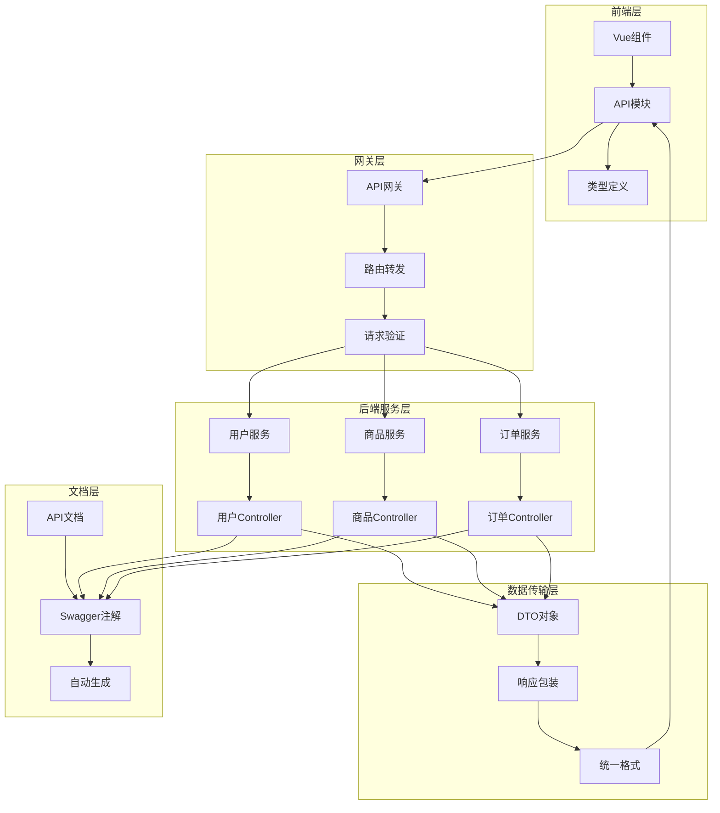
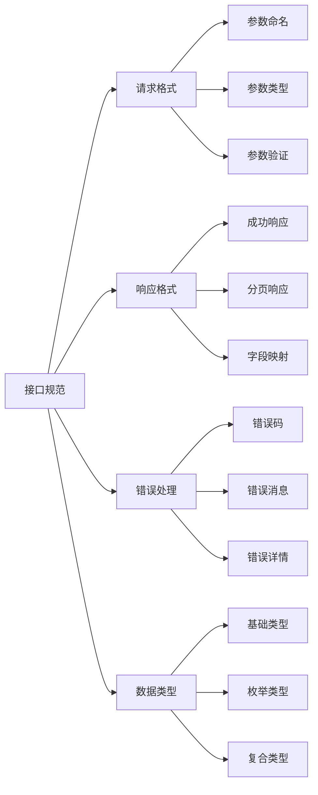

# 接口一致性修复设计文档

## 概述

本设计文档详细描述了如何系统性地修复电商ERP系统中前后端接口不一致的问题。通过分析现有的接口实现、识别不一致点、设计统一的接口规范，并提供具体的修复方案，确保API文档、前端代码和后端实现三者保持完全一致。

## 架构

### 接口一致性架构图



### 接口规范层次结构



## 组件和接口

### 1. 统一响应格式组件

#### ApiResponse 基础响应格式
```typescript
interface ApiResponse<T = any> {
  code: number          // 响应状态码
  message: string       // 响应消息
  data?: T             // 响应数据
  timestamp: string    // 响应时间戳
  error?: string       // 错误码（仅错误时）
  details?: ErrorDetail[] // 错误详情（仅参数错误时）
}

interface ErrorDetail {
  field: string        // 错误字段
  message: string      // 错误消息
  value?: any         // 错误值
}
```

#### PageResponse 分页响应格式
```typescript
interface PageResponse<T> {
  content: T[]         // 数据列表
  page: number         // 当前页码（从1开始）
  size: number         // 每页大小
  total: number        // 总记录数
  totalPages: number   // 总页数
}
```

### 2. 用户接口统一组件

#### 登录响应格式
```typescript
interface LoginResponse {
  accessToken: string    // 访问令牌
  refreshToken: string   // 刷新令牌
  tokenType: string      // 令牌类型（Bearer）
  expiresIn: number      // 过期时间（秒）
  userInfo: UserInfo     // 用户信息
}

interface UserInfo {
  id: number
  username: string
  realName: string       // 真实姓名（统一字段名）
  nickname?: string
  email: string
  phone?: string
  avatar?: string
  status: number         // 数字状态：0-禁用，1-启用
  statusStr: string      // 字符串状态：ACTIVE/INACTIVE
  locked: number         // 锁定状态：0-未锁定，1-锁定
  lastLoginTime?: string
  lastLoginIp?: string
  roleNames: string[]    // 角色名称数组
  roles: Role[]          // 角色详情数组
  permissions: string[]  // 权限代码数组
  createTime: string     // 创建时间
  remark?: string        // 备注
}
```

#### 用户查询参数
```typescript
interface UserQuery extends PageRequest {
  username?: string      // 用户名查询
  realName?: string      // 真实姓名查询
  status?: number        // 状态查询（数字类型）
}

interface CreateUserForm {
  username: string
  realName: string       // 统一使用realName
  nickname?: string
  email: string
  phone: string
  password: string
  status: number         // 数字类型状态
  remark?: string
}
```

### 3. 商品接口统一组件

#### 商品信息格式
```typescript
interface Product {
  id: number
  sku: string
  name: string           // 统一使用name字段
  title?: string         // 兼容字段，映射到name
  description?: string
  categoryId: number     // 统一使用数字类型
  category?: string      // 兼容字段，分类名称
  brand?: string
  price: number
  costPrice?: number
  weight?: number
  dimensions?: string    // 统一使用字符串格式
  images: string[]
  attributes: Record<string, any>
  status: ProductStatus  // 枚举类型
  createdAt: string
  updatedAt: string
}

enum ProductStatus {
  ACTIVE = 'ACTIVE',
  INACTIVE = 'INACTIVE', 
  DELETED = 'DELETED'
}
```

#### 商品查询和操作参数
```typescript
interface ProductQuery extends PageRequest {
  keyword?: string       // 关键词搜索
  categoryId?: number    // 分类ID（数字类型）
  brand?: string
  status?: ProductStatus
}

interface CreateProductForm {
  sku: string
  name: string           // 统一字段名
  description?: string
  categoryId: number     // 数字类型
  brand?: string
  price: number
  costPrice?: number
  weight?: number
  dimensions?: string
  images?: string[]
  attributes?: Record<string, any>
  status: ProductStatus
}
```

### 4. 错误处理组件

#### 统一错误码定义
```typescript
enum ErrorCode {
  // 通用错误
  SUCCESS = 200,
  INVALID_PARAMETER = 400,
  UNAUTHORIZED = 401,
  FORBIDDEN = 403,
  NOT_FOUND = 404,
  INTERNAL_ERROR = 500,
  
  // 用户相关错误
  USER_NOT_FOUND = 'USER_NOT_FOUND',
  USER_ALREADY_EXISTS = 'USER_ALREADY_EXISTS',
  INVALID_CREDENTIALS = 'INVALID_CREDENTIALS',
  TOKEN_EXPIRED = 'TOKEN_EXPIRED',
  
  // 商品相关错误
  PRODUCT_NOT_FOUND = 'PRODUCT_NOT_FOUND',
  SKU_ALREADY_EXISTS = 'SKU_ALREADY_EXISTS',
  INSUFFICIENT_INVENTORY = 'INSUFFICIENT_INVENTORY'
}
```

#### 错误响应处理器
```typescript
interface ErrorHandler {
  handleValidationError(errors: ValidationError[]): ApiResponse<null>
  handleBusinessError(errorCode: string, message: string): ApiResponse<null>
  handleSystemError(error: Error): ApiResponse<null>
}
```

## 数据模型

### 1. 字段映射规则

#### 用户相关字段映射
| 前端字段 | 后端字段 | 类型 | 说明 |
|---------|---------|------|------|
| realName | realName | string | 真实姓名，统一字段名 |
| status | status | number | 数字状态：0-禁用，1-启用 |
| statusStr | statusStr | string | 字符串状态：ACTIVE/INACTIVE |
| roleNames | roleNames | string[] | 角色名称数组 |
| createTime | createTime | string | 创建时间 |

#### 商品相关字段映射
| 前端字段 | 后端字段 | 类型 | 说明 |
|---------|---------|------|------|
| name | name | string | 商品名称，统一字段名 |
| categoryId | categoryId | number | 分类ID，数字类型 |
| dimensions | dimensions | string | 尺寸信息，字符串格式 |
| status | status | enum | 枚举状态：ACTIVE/INACTIVE/DELETED |

### 2. 数据转换规则

#### 前端到后端转换
```typescript
class DataTransformer {
  // 用户数据转换
  transformUserForBackend(user: CreateUserForm): BackendUserForm {
    return {
      username: user.username,
      realName: user.realName,  // 保持字段名一致
      nickname: user.nickname,
      email: user.email,
      phone: user.phone,
      password: user.password,
      status: user.status,      // 数字类型
      remark: user.remark
    }
  }
  
  // 商品数据转换
  transformProductForBackend(product: CreateProductForm): BackendProductForm {
    return {
      sku: product.sku,
      name: product.name,       // 统一使用name
      description: product.description,
      categoryId: product.categoryId, // 数字类型
      brand: product.brand,
      price: product.price,
      costPrice: product.costPrice,
      weight: product.weight,
      dimensions: product.dimensions, // 字符串格式
      images: product.images,
      attributes: product.attributes,
      status: product.status    // 枚举类型
    }
  }
}
```

#### 后端到前端转换
```typescript
class ResponseTransformer {
  // 用户响应转换
  transformUserResponse(backendUser: BackendUser): User {
    return {
      ...backendUser,
      realName: backendUser.realName, // 保持字段名
      status: backendUser.status,     // 数字状态
      statusStr: backendUser.status === 1 ? 'ACTIVE' : 'INACTIVE', // 添加字符串状态
      roleNames: backendUser.roleNames || []
    }
  }
  
  // 商品响应转换
  transformProductResponse(backendProduct: BackendProduct): Product {
    return {
      ...backendProduct,
      name: backendProduct.name,      // 统一字段名
      categoryId: backendProduct.categoryId, // 数字类型
      dimensions: backendProduct.dimensions,  // 字符串格式
      status: backendProduct.status as ProductStatus
    }
  }
}
```

## 错误处理

### 1. 错误分类和处理策略

#### 参数验证错误
```typescript
interface ValidationErrorHandler {
  code: 400
  message: "请求参数错误"
  error: "INVALID_PARAMETER"
  details: [
    {
      field: "realName",
      message: "真实姓名不能为空",
      value: null
    },
    {
      field: "status", 
      message: "状态必须是数字类型",
      value: "ACTIVE"
    }
  ]
}
```

#### 业务逻辑错误
```typescript
interface BusinessErrorHandler {
  code: 404
  message: "用户不存在"
  error: "USER_NOT_FOUND"
  timestamp: "2024-01-01T12:00:00Z"
}
```

#### 系统异常错误
```typescript
interface SystemErrorHandler {
  code: 500
  message: "服务器内部错误"
  error: "INTERNAL_ERROR"
  timestamp: "2024-01-01T12:00:00Z"
}
```

### 2. 前端错误处理机制

#### API拦截器错误处理
```typescript
class ApiErrorHandler {
  handleResponse(response: AxiosResponse): any {
    const { data } = response
    
    // 成功响应
    if (data.code === 200) {
      return data.data
    }
    
    // 业务错误
    if (data.code >= 400 && data.code < 500) {
      this.handleBusinessError(data)
      throw new BusinessError(data.message, data.error, data.details)
    }
    
    // 系统错误
    if (data.code >= 500) {
      this.handleSystemError(data)
      throw new SystemError(data.message)
    }
  }
  
  handleBusinessError(errorData: ApiResponse<null>): void {
    // 显示业务错误消息
    ElMessage.error(errorData.message)
    
    // 处理参数验证错误
    if (errorData.details) {
      this.showValidationErrors(errorData.details)
    }
  }
  
  handleSystemError(errorData: ApiResponse<null>): void {
    // 显示系统错误消息
    ElMessage.error('系统异常，请稍后重试')
    
    // 记录错误日志
    console.error('System Error:', errorData)
  }
}
```

## 测试策略

### 1. 接口一致性测试

#### 自动化测试框架
```typescript
class InterfaceConsistencyTest {
  // 测试登录接口响应格式
  async testLoginResponseFormat() {
    const response = await userApi.login({
      username: 'admin',
      password: 'admin123'
    })
    
    // 验证响应字段
    expect(response.data).toHaveProperty('accessToken')
    expect(response.data).toHaveProperty('refreshToken')
    expect(response.data).toHaveProperty('tokenType')
    expect(response.data).toHaveProperty('expiresIn')
    expect(response.data).toHaveProperty('userInfo')
    
    // 验证用户信息字段
    const userInfo = response.data.userInfo
    expect(userInfo).toHaveProperty('realName')
    expect(userInfo).toHaveProperty('status')
    expect(typeof userInfo.status).toBe('number')
    expect(userInfo).toHaveProperty('roleNames')
    expect(Array.isArray(userInfo.roleNames)).toBe(true)
  }
  
  // 测试分页响应格式
  async testPageResponseFormat() {
    const response = await userApi.getUsers({ page: 1, size: 10 })
    
    // 验证分页字段
    expect(response.data).toHaveProperty('content')
    expect(response.data).toHaveProperty('page')
    expect(response.data).toHaveProperty('size')
    expect(response.data).toHaveProperty('total')
    expect(response.data).toHaveProperty('totalPages')
    
    // 验证数据类型
    expect(Array.isArray(response.data.content)).toBe(true)
    expect(typeof response.data.page).toBe('number')
    expect(typeof response.data.total).toBe('number')
  }
}
```

### 2. 字段映射测试

#### 字段一致性验证
```typescript
class FieldMappingTest {
  // 测试用户字段映射
  testUserFieldMapping() {
    const createForm: CreateUserForm = {
      username: 'testuser',
      realName: '测试用户',  // 使用realName字段
      email: 'test@example.com',
      phone: '13800138000',
      password: 'password123',
      status: 1             // 数字类型状态
    }
    
    // 验证字段转换
    const transformed = dataTransformer.transformUserForBackend(createForm)
    expect(transformed.realName).toBe('测试用户')
    expect(transformed.status).toBe(1)
  }
  
  // 测试商品字段映射
  testProductFieldMapping() {
    const createForm: CreateProductForm = {
      sku: 'TEST001',
      name: '测试商品',      // 使用name字段
      categoryId: 1,        // 数字类型
      price: 99.99,
      status: ProductStatus.ACTIVE
    }
    
    // 验证字段转换
    const transformed = dataTransformer.transformProductForBackend(createForm)
    expect(transformed.name).toBe('测试商品')
    expect(transformed.categoryId).toBe(1)
    expect(transformed.status).toBe('ACTIVE')
  }
}
```

### 3. API文档验证测试

#### 文档与实现一致性检查
```typescript
class DocumentationTest {
  // 验证API文档示例与实际响应一致
  async validateDocumentationExamples() {
    // 获取实际API响应
    const actualResponse = await userApi.login({
      username: 'admin',
      password: 'admin123'
    })
    
    // 与文档示例对比
    const documentedFields = [
      'accessToken', 'refreshToken', 'tokenType', 
      'expiresIn', 'userInfo'
    ]
    
    documentedFields.forEach(field => {
      expect(actualResponse.data).toHaveProperty(field)
    })
    
    // 验证用户信息字段
    const userInfoFields = [
      'id', 'username', 'realName', 'email', 
      'status', 'roleNames'
    ]
    
    userInfoFields.forEach(field => {
      expect(actualResponse.data.userInfo).toHaveProperty(field)
    })
  }
}
```

## 实施计划

### 阶段1：后端接口规范化（优先级：高）
1. 统一响应格式包装器
2. 修正用户相关接口字段
3. 修正商品相关接口字段
4. 统一错误处理机制

### 阶段2：前端代码适配（优先级：高）
1. 更新TypeScript类型定义
2. 修正API调用参数
3. 更新响应数据处理
4. 适配错误处理逻辑

### 阶段3：API文档更新（优先级：中）
1. 更新接口参数文档
2. 更新响应格式文档
3. 更新错误码文档
4. 添加完整示例

### 阶段4：测试验证（优先级：中）
1. 编写接口一致性测试
2. 编写字段映射测试
3. 编写文档验证测试
4. 集成自动化测试

### 阶段5：长期维护（优先级：低）
1. 建立接口规范文档
2. 添加代码生成工具
3. 建立持续集成检查
4. 定期一致性审查